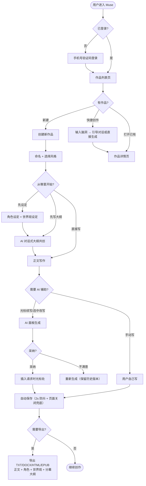

# Muse - 产品需求文档 (PRD)

## 0. 文档信息

### 0.1 文档状态

| 字段 | 内容 |
|------|------|
| 当前版本 | 2.0 稿（与代码现状对齐） |
| 当前阶段 | MVP 迭代中 |
| 创建日期 | 2026-07-28 |
| 最后更新 | 2026-08-15 |

### 0.2 更新记录

| 版本号 | 版本状态 | 更新日期 | 核心更新内容 |
|--------|----------|----------|--------------|
| 1.1 | 需求初稿 | 2026-07-28 | 完整需求背景、目标、功能列表、业务流程、细节方案 |
| 1.2 | MVP 开发中 | 2026-08-06 | 短篇小说支持、多 API Key 管理、千问平台模型、封面/立绘历史版本、简介生成、快捷创作、永久删除、测试补全 |
| 2.0 | 现状对齐 | 2026-08-15 | 编辑器迁移 Tiptap、AI 统一对话流、引导模式、TTS 推文视频、知乎包装、自动保存、字数口径、安全加固、移除项（合并/拆分、设定提取、角色关系、分幕拖拽、世界观模板导入） |

### 0.3 名词解释

| 术语 | 解释 |
|------|------|
| Token | AI 模型处理文本的最小计量单位，也是平台的计费单位。约 1 个中文字 ≈ 1.5-2 token |
| 分幕骨架 | 三幕剧结构（开端/对抗/结局），大纲节点可按幕归类 |
| 自定义字段 | 用户在角色表单中自行添加的键值对字段，用于补充表单预设之外的角色属性 |
| 引导模式 | 快捷创作前与 AI 的对话式共创：AI 提问、用户回答，最终产出创作方向摘要后一键生成 |

---

## 一、需求背景与目标

（1.1 项目概述、1.2 核心问题、1.3 用户故事、1.4 目标价值不变，从略——Muse 是面向小说创作者的 AI 写作助手 Web 应用，围绕"设定 + 大纲 + 写作"一体化工作台，强调 AI 辅助而非代写。）

### 1.5 需求范围

#### In-Scope（范围内）

- 用户账号体系（手机号 + 验证码登录，JWT 12h，登录 Cookie 供静态资源鉴权）
- 作品管理（创建/编辑/软删除 7 天可恢复/永久删除/批量操作，长/短篇类型）
- 角色设定工作台（结构化表单 + 自定义字段 + AI 立绘生成与历史版本）
- 世界观设定工作台（分区文本框 + AI 对话修改）
- 对话式大纲共创（AI 对话引导 → 结构化章节摘要列表 + 分幕归类）
- AI 辅助续写/改写（统一 AI 对话面板，光标续写 + 选中改写 + 重新生成保留历史版本）
- 角色对话测试（验证人设一致性）
- 预置模板库 + 用户保存作品设定为模板
- 导出（TXT/DOCX/HTML/EPUB，含正文 + 角色（含自定义字段）+ 世界观 + 分幕大纲）
- 编辑器（自动保存、章节列表、纯文本粘贴清理）
- 写作风格（预设风格 + AI 模仿笔风分析）
- 快捷创作（长篇：世界观+大纲+角色+书名；短篇：梗概确认 → 完整故事 + 书名候选；引导模式）
- 附加功能（暗色模式、字数统计/码字目标、AI 作品简介、AI 封面图 + 角色立绘、TTS 推文视频、知乎体包装）
- Admin 后台（用户管理、用量查询、平台总用量、模板库管理）
- 多 API Key 管理（用户自定义 Key 按文本/生图/通用区分，前端精确选择，平台 Key 兜底）

#### Out-of-Scope（范围外）

- AI 角色陪伴聊天、社交/社区/评论、内容分发/阅读平台
- 传统拖拽式大纲编辑器（大纲形态是对话）、大纲分幕拖拽归类
- **章节合并/拆分**（v2.0 已移除）
- **AI 设定提取**（v2.0 已移除）
- **角色关系图谱 / 角色关系管理**（v2.0 已移除，无前端入口）
- **世界观模板导入**（v2.0 已移除，仅支持保存为模板）
- 章节历史版本（Git 式 diff）、场景级编辑、写作日历、正文内注释、AI 朗读、章节过渡检测
- 多端实时协作、离线模式（规划中）、拼写/语法纠错（规划中）

### 1.6 需求列表

| 需求ID | 模块 | 需求描述 | 优先级 | 状态 | 备注 |
|--------|------|----------|--------|------|------|
| R001 | 账号 | 手机号 + 验证码登录，JWT 12h | P0 | 已实现 | 60s 发送冷却、5 次错误锁定 10 分钟、登录 Cookie |
| R002 | 作品 | 创建/编辑/软删除（7 天恢复）+ 永久删除 + 长/短篇 | P0 | 已实现 | 短篇无章节概念（写作页隐藏章节列表）；永久删除仅限回收站 |
| R003 | 角色设定 | 结构化表单（固定字段 + 自定义键值对）+ AI 生成立绘 | P0 | 已实现 | 立绘支持模型切换、尺寸、历史版本（保留 20 条）；无角色关系 |
| R004 | 世界观设定 | 分区文本框（预设 + 自定义分区） | P0 | 已实现 | AI 对话修改按分区合并，不覆盖其他分区 |
| R005 | 大纲 | 对话式 AI 引导共创，产出章节摘要列表 | P0 | 已实现 | 大纲不可跨作品复用 |
| R006 | 大纲 | 大纲面板旁 AI 对话框 + 节点编辑 | P0 | 已实现 | |
| R007 | 大纲 | 分幕骨架手动拖拽章节归类 | P0 | 已移除 | 分幕由 AI 创建节点时归类，无拖拽 |
| R008 | AI 续写 | 光标续写 + 选中改写 | P0 | 已实现 | 统一 AI 对话面板，采纳后精确插入请求时光标处 |
| R009 | AI 续写 | 多版本预览切换 | P0 | 已实现（形态变更） | 重新生成保留历史版本可翻页，采纳一个 |
| R010 | AI 续写 | 给反馈方向重新生成 | P0 | 已实现 | 点"重新生成"展开反馈输入框（可选），反馈注入本次请求，不污染消息历史 |
| R011 | 角色对话 | 角色卡片"测试对话"，聊天窗口 | P1 | 已实现 | 会话与角色强绑定 |
| R012 | 模板 | 角色/世界观/大纲三种预置模板 | P1 | 已实现 | 列表按创建时间倒序 |
| R013 | 模板 | 用户保存作品设定为模板 | P1 | 已实现 | |
| R014 | 导出 | TXT/DOCX/HTML/EPUB，含正文+设定+大纲 | P1 | 已实现 | 角色含自定义字段；大纲按分幕输出；导出记审计日志 |
| R015 | AI 设定提取 | 手动触发 → 逐条确认 | P1 | 已移除 | |
| R016 | 写作风格 | 预设风格 + 每次续写可切换 + AI 模仿笔风 | P1 | 已实现 | 5 个预设（快节奏网文/晋江文风/文艺细腻/古风/平实口语）；"我的笔风"选项在分析后出现并注入生成链路 |
| R017 | 编辑器 | 自动保存、章节列表 | P0 | 已实现 | 自动保存 = 停止输入 2s 防抖 + 页面隐藏/关闭/切章节兜底；合并/拆分已移除 |
| R018 | 编辑器 | 粘贴格式清理 | P0 | 已实现 | 纯文本粘贴，按行拆段落 |
| R019 | 费用 | 多 API Key 管理 | P0 | 已实现 | 文本/生图/通用三种用途；key_id 精确选择；SSRF 防护 |
| R020 | 费用 | 平台内置 DeepSeek + 千问 + 豆包 | P0 | 已实现 | 用户 Key 优先、平台 Key 兜底；**月额度拦截未实现（仅记账）** |
| R021 | 附加 | 暗色模式 | P2 | 已实现 | |
| R022 | 附加 | 字数统计/码字目标 | P2 | 已实现 | 中文按字/英文按词；每日增量日志，本地日期 |
| R023 | 附加 | AI 自动生成作品简介 | P2 | 已实现 | 支持模型切换 |
| R024 | 附加 | 拼写/语法纠错 | P2 | 规划中 | |
| R025 | 附加 | 角色关系图谱 | P2 | 已移除 | |
| R026 | 附加 | AI 生成封面图 + 角色立绘 | P2 | 已实现 | 模型切换、尺寸/比例、历史版本 |
| R027 | 附加 | 快捷创作 | P1 | 已实现 | 长篇/短篇/引导模式；短篇流水线：3 方向梗概候选（骨架入库）→ 情绪节拍表（5-7 拍，相邻拍情绪相反，Pro 设计）→ 两轮正文（骨架+节拍表逐拍执行，前半骨架回灌后半）→ 精修审稿（文风锚+代码级 AI 味检测）→ 书名候选 |
| R028 | 附加 | 多 API Key + 模型切换 | P0 | 已实现 | 与 R019/R020 合并口径 |
| R029 | 附加 | 作品简介 AI 生成 | P2 | 已实现 | 与 R023 重复 |
| R030 | 附加 | 离线模式 | P2 | 规划中 | |
| R031 | Admin | 用户管理、用量查询、模板库管理 | P1 | 已实现 | 含平台总用量（全站 token/按模型） |

### 1.7 v2.0 新增功能（1.2 版文档未覆盖）

- **AI 统一对话面板**：写作/大纲/角色/世界观/设置/推广/短篇共用一个聊天流（SSE），AI 通过尾部 JSON action 返回结构化指令（增删改大纲节点、修改世界观分区等），用户点"采纳"执行
- **引导模式**：快捷创作前与 AI 对话共创，产出创作摘要，可一键生成长篇或短篇；中断后自动恢复
- **TTS 推文视频**：选中正文 → 逐句配音 → 合成字幕视频（解压背景模式）或生成卡片素材包（ZIP）
- **知乎体包装**：短篇生成知乎体标题与抓人开篇，可一键替换章节开头
- **AI 章节会话管理**：会话归档/恢复/删除，流式内容 3 秒自动落库，刷新可恢复
- **软删除联动**：删除作品时取消该作品进行中的 AI 生成，停止消耗 token

---

## 二、方案概述

### 2.1 核心业务流程图

### 2.2 信息架构（核心页面）

- **登录页**：手机号 + 验证码
- **作品列表页**：作品卡片（封面/书名/字数/状态）、新建、快捷创作（长篇/短篇/引导）、回收站、模板入口
- **作品详情页**（Tab 结构）：
  - 写作：编辑器 + 章节侧栏（短篇隐藏）+ AI 面板 + 大纲绑定下拉
  - 大纲：对话区 + 大纲面板（节点增删改、标记完成、分幕展示、保存为模板）
  - 角色：角色卡片（立绘生成/历史）+ 表单（固定 + 自定义字段）+ 测试对话
  - 世界观：分区编辑器 + AI 面板
  - 统计：字数/连续打卡/码字目标
  - 设置：风格、封面生成（模型/尺寸/历史）、简介、笔风分析、视觉风格推荐
- **Admin 页**：用户管理（状态/配额）、平台总用量、模板管理

---

## 三、细节方案（v2.0 修订要点）

### 3.1 账号与登录

- 验证码：`crypto.randomInt` 生成，5 分钟有效，一次性消费；**同一手机号 60 秒内只发一次**；登录失败 5 次锁定 10 分钟；手机号格式校验（1 开头 11 位）
- 旧验证码不作废（防"刷发送作废他人验证码"DoS）
- JWT 12h；登录同时种 httpOnly Cookie（`muse_token`），用于 `/uploads` 静态资源鉴权
- 后端统一 401 语义：JWT 失效 → 401 → 前端清登录态跳登录页；暂停/封禁 → 403
- 过期验证码由维护任务定期清理

### 3.2 作品管理

- 软删除 7 天内可恢复（超窗明确报错）；永久删除**仅限回收站中的作品**；支持批量恢复/批量永删
- 删除作品时中止该作品进行中的 AI 生成（abort registry）
- 软删除后所有接口 404（恢复/永删接口豁免）
- 书籍状态：首次保存正文后 draft → writing（completed 暂无流转入口）
- 短篇：自动创建唯一章节"正文"，写作页隐藏章节列表

### 3.3 角色设定

- 固定字段：姓名、性别、外貌、性格、口头禅、说话风格、身份、背景、动机、别名、主要角色标记
- **年龄不是固定字段**：成长线（如"外表20实际500"、"15→200随境界成长"）用自定义字段表达，自由文本不受数字约束；AI 快捷创作创建角色时年龄解析结果也自动放入自定义字段
- 自定义字段：键值对；**字段名不得与固定字段重名**（表单校验）
- 立绘生成：豆包/千问模型切换、尺寸与比例独立选择、历史版本保留最近 20 条
- 角色测试对话：会话与角色强绑定，跨角色会话拒绝；用户消息经注入过滤 + 长度限制

### 3.4 世界观设定

- 四个预设分区 + 自定义分区；AI 对话修改**按分区名合并**，不会清空未提及分区
- 编辑中的内容不被 AI 采纳/refetch 覆盖（本地快照对比）
- 支持保存为模板；不支持模板导入

### 3.5 对话式大纲共创

- AI 对话实时更新大纲节点（`outline_update`/action 采纳）；节点支持编辑、删除、标记完成/重新打开
- **绑定为单向**：章节 → 大纲节点（章节保存时绑定）；节点状态流转：planned →（章节保存非空内容）writing →（用户标记）completed；章节删除时节点回退 planned
- AI 续写上下文按"已完成前置节点 + 当前节点 + 下一节点"组装
- 分幕：AI 创建节点时指定幕名归类；无拖拽

### 3.6 AI 辅助续写（统一对话面板）

- **入口**：作品详情页右侧 AI 面板，一个对话流服务写作/大纲/角色/世界观/设置/推广/短篇七种上下文
- **光标续写**：发起时记录章节 + 光标位置；采纳后**精确插入请求时光标处**（章节不匹配则忽略并提示）
- **选中改写**：发起时记录选区坐标；采纳时坐标校验 + 文本回退查找
- **多版本**：点"重新生成"展开反馈输入框（可选填方向），带反馈重新生成并保留历史版本，可翻页切换后采纳其一；反馈只注入本次请求，不写回消息历史
- **写作风格**：5 个预设（快节奏网文/晋江文风/文艺细腻/古风/平实口语，统一按语言质感维度）；快节奏网文模板按 2026 年主流网文平台（番茄/起点）写法定义：写"人话"动词为主、手机屏 5 行内短段落、动作对话展示、冲突前置 + 打压→反转→打脸爽点节奏、真细节传情绪、章末强钩子；晋江文风跨频道通用（言情/纯爱/百合/无CP），核心是细腻心理描写、留白、情绪逻辑与情感质感；做过笔风分析后下拉出现"我的笔风"，选中后注入分析结果
- **自动保存**：停止输入 2 秒防抖保存；页面隐藏/关闭/切章节前兜底保存；保存失败拦截章节切换
- **字数口径**：服务端统一计算——中文按字、英文/数字按词、标点空白不计；码字目标与每日统计同口径
- **粘贴**：纯文本粘贴，按行拆段落，外部格式全部剥离
- **SSE 错误**：携带上游状态码（401/403 Key 失效、429 限流可区分）
- **中断止损**：客户端断开 → 取消上游请求；删除作品 → 中止该作品全部 AI 请求
- **长篇记忆体系（跨会话不失忆）**：
  - 写作交接摘要：章节字数较上次摘要增长 ≥800 字时更新（150 字内：剧情位置/主角状态/未收伏笔），随续写注入
  - 伏笔账本：交接摘要顺带输出"伏笔：描述 | 待收/已收"，存 book_settings.extra.plot_threads；续写时注入活跃伏笔（≤8 条）
  - 章节摘要链：内容 ≥3000 字且较上次摘要增长 ≥1500 字时异步生成 100 字摘要（不阻塞保存），续写时注入最近 3 章梗概
  - 上下文按需注入：只注入当前章节正文中出现的角色（+主要角色）；世界观注入截断 2000 字
- **短篇一致性防线**：梗概骨架五字段（起因强制脑洞要素与关系过渡、物证=来龙去脉、因果自洽三环）；代码级脑洞要素滑窗过滤（命中 <2 的方向丢弃，整批跑题时升温重生成）；重生题材时间线铁律（前世物件/证据不随重生带回）；节拍表回收清单（谜团→答案→揭示拍，代码级兑现检查）；两轮正文接缝清洗（空行/分隔线/复读去重/评审评论行清除）；事实清单跨轮回灌（事实|谁知道）；精修局部化（检测命中处 ±150 字）+ 结构维度检测（句长均匀/段末总结句/三元排比）+ 效果闭环（问题数 前→后）；书名基于梗概+正文开头+正文结尾（提炼实际反转与金句）

### 3.7 模板库 / 3.8 导出 / 3.9 Admin

- **模板**：预置 + 用户保存分享；列表按创建时间倒序
- **导出**：TXT/HTML/EPUB 含正文 + 角色（含自定义字段）+ 世界观 + 分幕大纲（未分幕节点归"未分幕"）；DOCX 含正文；每次导出记录审计日志（export_records）
- **Admin**：用户列表（分页参数校验）、状态/配额调整、单用户月度用量、平台总用量（全站 token + 按模型分布）

### 3.10 非功能性需求

| 指标 | 要求 |
|------|------|
| 编辑器响应 | 10 万字单章内编辑器无卡顿（AI 面板不再订阅编辑器全量状态） |
| AI 生成 | SSE 流式返回，首字符延迟 < 3s |
| 自动保存 | 静默保存，不阻塞编辑；页面关闭 best-effort（keepalive） |
| 安全 | SSRF 防护（自定义 Key base_url 校验）、/uploads 登录鉴权、验证码防护、登录失败锁定 |

### 3.11 数据统计需求（现有）

| 事件 | 触发时机 | 参数 |
|------|----------|------|
| login_success / send_code | 登录页 | user_id, phone |
| create_book / delete_book / restore_book / permanent_delete | 作品列表 | book_id |
| ai_chat_start / ai_adopt / ai_regenerate | AI 面板 | book_id, chapter_id, model, key 来源 |
| export_book | 导出 | book_id, format, user_id（落库 export_records） |
| token_usage | 每笔 AI 请求 | user_id, book_id, token_count, model, usage_type |
| daily_word_log | 每次章节保存 | book_id, 当日增量（仅增长） |

---

## 四、上线计划与运营

- 第一阶段：MVP 自用，验证核心流程（创建作品 → 设定 → 大纲 → AI 续写 → 导出）✓ 当前阶段
- 第二阶段：迭代优化（反馈重新生成、笔风接入生成、月额度拦截）
- 第三阶段：对外小范围开放
 