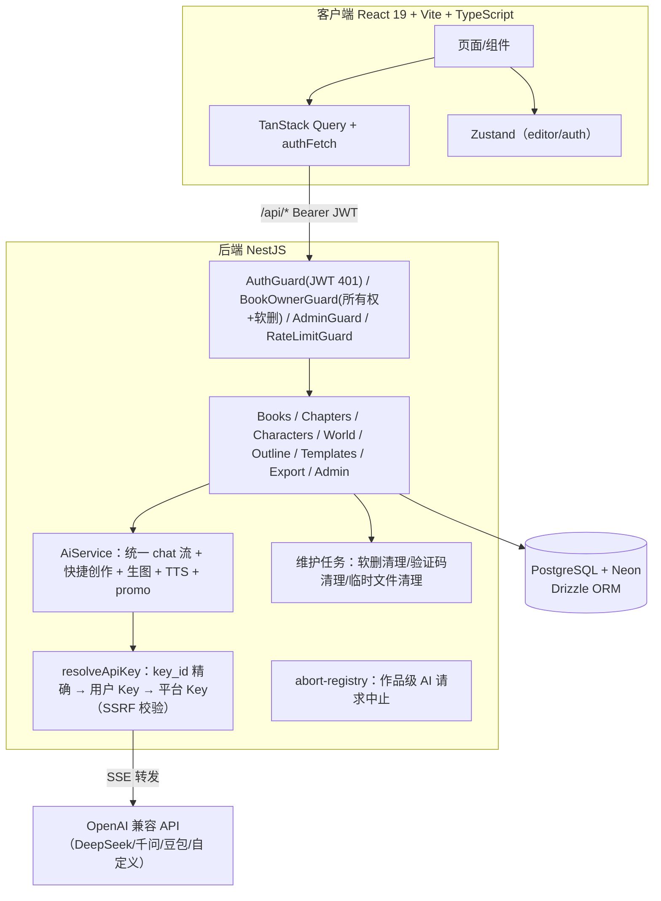

# Muse — 技术方案设计文档

## 文档信息

| 字段 | 内容 |
|------|------|
| 对应 PRD | [PRD-Muse.md](./PRD-Muse.md)（v2.0） |
| 创建日期 | 2026-07-28 |
| 最后更新 | 2026-08-15 |

---

## 一、数据模型（现状）

### 1.1 核心实体

```mermaid
erDiagram
    User ||--o{ Book : owns
    User ||--o{ UserApiKey : has
    User ||--o{ TokenUsageRecord : has
    User ||--o{ UserMonthlyQuota : has
    User ||--o{ VerificationCode : requests
    Book ||--|| BookSettings : has
    Book ||--|| WorldSetting : has
    Book ||--|| Outline : has
    Book ||--o{ Chapter : has
    Book ||--o{ Character : has
    Book ||--o{ AiChatSession : has
    Book ||--o{ ExportRecord : has
    Outline ||--o{ OutlineChapter : contains
    OutlineChapter ||--o| OutlineActChapter : in-act
    Chapter }o--o| OutlineChapter : binds(单向,章节侧存节点id)
    Character ||--o{ CharTestDialogSession : has
```

### 1.2 表结构摘要

| 表 | 关键字段 | 说明 |
|----|----------|------|
| users | user_id, phone_number, phone_hash, phone_encrypted, role, status(active/suspended/banned), book_limit | 手机号哈希+密文存储 |
| verification_codes | phone_number, code, expires_at, used | 5 分钟有效，一次性消费；过期由维护任务清理 |
| books | user_id, title, cover_url, word_count, status(draft/writing/completed), type(novel/short), deleted_at | 软删除仅用 deleted_at；status 首次保存正文时 draft→writing |
| book_settings | book_id, preset_style, extra(JSONB) | extra 存：daily_word_log（每日字数增量）、cover_history（截断 20 条）、mimic_style_analysis、synopsis、guide_summary 等 |
| characters | book_id, 固定字段列 + custom_fields(JSONB) + avatar_url + avatar_history(JSONB 截断 20 条) | 无角色关系 |
| character_relations | source/target/relation_type | **已废弃**：无接口无前端，表保留未用 |
| world_settings | book_id, sections(JSONB: [{name, content, sort_order}]) | 全量替换语义；AI 修改在前端按分区名合并 |
| outlines | book_id（一对一） | |
| outline_chapters | outline_id, title, summary, bound_chapter_id(冗余列，已不用), status(planned/writing/completed), sort_order | 状态由章节保存/删除/用户标记驱动 |
| outline_act_chapters | outline_id, act_name, chapter_id(PK), sort_order | 分幕关系表（替代旧 JSONB acts） |
| chapters | book_id, title, content, sort_order, word_count, bound_outline_node_id | **单向绑定**：章节存大纲节点 id（无 FK，删除节点时应用层清理） |
| ai_chat_sessions | book_id/null, user_id, section, title, active, messages(JSONB) | 统一 AI 面板会话；guide 会话 book_id 为 null |
| char_test_dialog_sessions | char_id, messages(JSONB) | 会话与角色强绑定 |
| user_api_keys | user_id, name, api_key_encrypted, encryption_iv, base_url, model_name, usage(chat/image/both), is_active | AES-256-GCM 加密；base_url 存取双校验（SSRF 防护） |
| token_usage_records | user_id, book_id, token_count, model_name, usage_type(platform_key/user_key) | 明细 |
| user_monthly_quota | user_id, month, used_tokens | 月度汇总（本地月份）；**仅记账，未做额度拦截** |
| templates | name, type, category, data, is_preset, is_public, creator_user_id | 列表按 created_at 倒序 |
| export_records | book_id, user_id, format, include_settings | 每次导出写审计记录 |

---

## 二、API 设计（现状摘要）

所有接口前缀 `/api`，鉴权 AuthGuard（JWT，401 语义）+ BookOwnerGuard（所有权 + 软删拦截，恢复/永删用 @AllowDeleted 豁免）。

### 认证

| 方法 | 路径 | 说明 |
|------|------|------|
| POST | /auth/send-code | 手机号校验 + 60s 冷却；V1 直接返回验证码 |
| POST | /auth/login | 验证码登录（5 次错误锁 10 分钟）；种 httpOnly Cookie `muse_token` |
| POST | /auth/logout | 清 Cookie |
| GET | /user/profile | 用户信息 |

### 作品 / 章节 / 角色 / 世界观 / 大纲

| 方法 | 路径 | 说明 |
|------|------|------|
| GET/POST | /books | 列表（?status=active/deleted）/ 创建（配额校验） |
| GET/PATCH/DELETE | /books/:id | 详情 / 标题封面 / 软删除（**同时中止该作品 AI 请求**） |
| POST | /books/:id/restore | 7 天窗口校验，超窗 400 |
| DELETE | /books/:id/permanent | **仅回收站作品可永删** |
| POST | /books/batch-restore / batch-permanent-delete | 批量（仅回收站） |
| GET/PUT | /books/:id/settings | extra 合并写入 |
| GET | /books/:id/stats | 字数/连续打卡（读 daily_word_log，无日志回退旧口径） |
| GET/POST/PUT/DELETE | /books/:id/chapters[...] | 列表/创建/保存/删除；**保存时服务端重算字数（中文按字/英文按词）+ 每日增量日志 + 状态流转**；删除时绑定节点回退 planned |
| GET/POST/PATCH/DELETE | /books/:id/characters[...] | 角色 CRUD（字段白名单）；**无 relations 接口** |
| GET/PUT | /books/:id/world-setting | 全量 sections |
| GET/POST/PATCH/DELETE | /books/:id/outline/chapters[...] | 节点 CRUD + status 流转；删除节点时清章节侧绑定；**无 /bind 接口** |

### AI 统一对话与生成

| 方法 | 路径 | 说明 |
|------|------|------|
| POST | /ai/chat（SSE） | 统一入口：context_type ∈ write/outline/characters/world/settings/promo/short/**inspire**；guide_mode=true 时走引导 prompt；请求携带 chapter_id/cursor_position/style/model/key_id。write 上下文：角色按需注入（正文出现的+主要角色）+ 世界观截断 2000 字 + 写作交接摘要 + 活跃伏笔（plot_threads ≤8）+ 前情摘要（最近 3 章 summary）；字数差 ≥800 时更新交接摘要与伏笔账本 |
| GET/POST/PUT/DELETE | /ai/chat-sessions[...] | 会话列表/创建/消息保存/恢复/删除（guide 会话 book_id 传 "guide"） |
| POST | /ai/quick-create（SSE） | 长篇/短篇快捷创作（type=short 走两步式：3 方向梗概候选，骨架行提取入 book_settings.extra）；短篇含脑洞要素滑窗过滤（命中 <2 丢弃，整批跑题升温重生成）；step 事件推送进度 |
| POST | /ai/generate-story（SSE） | 短篇写完整故事 + 书名候选；**仅限 type=short 作品**。流水线：情绪节拍表（5-7 拍，Pro+thinking disabled，含回收清单）→ 两轮正文（骨架+节拍表逐拍注入，前半张力骨架+事实账本回灌后半，接缝清洗+复读去重）→ 精修（局部化 ±150 字 + 结构维度检测 + 问题数闭环）→ 回收清单代码级兑现检查 → 书名候选（梗概+正文开头+结尾） |
| PUT | /books/:id/chapters/:cid | 保存后异步章节摘要链：内容 ≥3000 字且较上次摘要增长 ≥1500 字时生成 100 字摘要（chapters.summary），不阻塞保存 |
| POST | /ai/generate-cover / generate-char-image | 生图（model/key_id/尺寸/比例；历史截断 20 条） |
| POST | /ai/generate-synopsis / mimic-style / recommend-style | 简介 / 笔风分析 / 视觉风格推荐（走统一 Key 解析） |
| POST | /ai/zhihu-pack | 知乎体标题 + 开篇 |
| POST | /ai/generate-speech | TTS（火山引擎） |
| POST | /books/:id/promo/generate / preview-voice / upload-background | 推文视频（script_text ≤1 万字、行数 ≤200、背景路径防穿越） |

**SSE 事件协议**（chat 流）：`chunk`（JSON 编码的增量文本）、`reasoning`（思维链）、`action`（尾部结构化指令 JSON：add_chapter/update_chapter/update_sections/update_section 或纯内容）、`error`（**携带上游 status**）、`done`。

### 导出 / 模板 / Admin

| 方法 | 路径 | 说明 |
|------|------|------|
| GET | /books/:id/export?format= | TXT/HTML/EPUB（正文+角色含自定义字段+世界观+分幕大纲）/DOCX（正文）；写 export_records |
| GET/POST/DELETE | /templates[...] | 公共列表（倒序）/创建/删除 |
| GET | /admin/users（page/pageSize 校验，≤100） | 用户列表 + 人均用量 |
| PATCH | /admin/users/:id | 状态/配额/角色 |
| GET | /admin/users/:id/usage?months= | 单用户月度用量 |
| GET | /admin/usage | **平台总用量**（全站 token/请求数/按模型） |

---

## 三、架构

### 3.1 系统架构



### 3.2 关键设计决策

| 决策 | 结论 | 理由 |
|------|------|------|
| AI Key 路由 | **全部后端代理**（不做前端直连） | 平台 Key 不暴露；用户 Key 由后端解密后转发；SSRF 白名单/私网拦截（存储时同步校验 + 请求时 DNS 复查） |
| 编辑器 | **Tiptap**（原文档写 Milkdown，已迁移） | StarterKit + Placeholder；纯文本 + 段落模型 |
| AI 续写形态 | **统一 /ai/chat 单流**（原"多版本并行 /ai/generate"已废弃） | 一个对话面板服务全部上下文；多版本由"重新生成保留历史版本"实现 |
| 大纲-章节绑定 | **单向**：章节存 bound_outline_node_id | 计划→产物的单向引用已满足 AI 上下文需求；双向同步是纯负担 |
| 字数口径 | 服务端重算：中文按字、英文/数字按词 | 客户端上报 length 失真；统一口径贯穿章节字数/作品总字数/每日统计 |
| 每日字数统计 | book_settings.extra.daily_word_log 增量日志（90 天） | 只记增长不记削减；编辑旧章节不重写历史；本地日期 |
| 自动保存 | 停止输入 2s 防抖 + visibilitychange/pagehide/unmount 兜底（keepalive） | 比固定 5 分钟间隔更可靠；切章节 await 保存失败拦截 |
| 上传文件鉴权 | 登录种 httpOnly Cookie，/uploads 中间件验 JWT | `` 无法携带 Authorization 头；Cookie 自动随请求 |
| 软删除取消 AI | abort-registry（bookId → AbortController 集合） | PRD 3.2.2 要求；chat 流与 generateStory 注册，softDelete 统一 abort |
| 登录防护 | 60s 冷却 + 5 次锁定 10 分钟 + 安全随机 + 手机号格式校验（内存态） | 防暴力破解与刷码 DoS；单实例部署够用，多实例需迁 Redis |
| 状态码语义 | AuthGuard 抛 401（JWT 失效）/ 403（封禁暂停）；DB 错误原样 500 | 前端按 401 清登录态跳登录页；DB 抖动不得被误判为登录过期 |
| 前端 fetch 统一 | api.*（15s 超时）+ authFetch（5min 超时，SSE/下载） | 统一 401 处理：清 token + 清 persist 状态 + 跳登录，杜绝死循环 |
| 错误可见性 | 列表加载失败与空状态分离展示 + 重试按钮；列表查询 retry 2、全局 retry 1 | 后端重启窗口期不再出现"作品消失"假象 |

### 3.3 环境变量

| 变量 | 说明 |
|------|------|
| AI_PLATFORM_KEY / AI_PLATFORM_BASE_URL | DeepSeek 平台 Key |
| QWEN_API_KEY / QWEN_BASE_URL / QWEN_IMAGE_URL | 千问 |
| VOLCANO_IMAGE_KEY / VOLCANO_TTS_KEY | 豆包生图 / 火山 TTS |
| JWT_SECRET / ENCRYPTION_KEY | JWT 签名 / API Key AES-256-GCM 加密 |
| DATABASE_URL | Neon PostgreSQL |
| PORT | 服务端口（server/.env 中 3004；main.ts 默认 3001） |

### 3.4 目录结构（现状）

```
muse/
├── client/src/
│   ├── components/{editor,outline,characters,world,settings,templates,promo,zhihu,layout,ui}
│   ├── pages/{LoginPage,BookListPage,BookDetailPage,AdminPage}
│   ├── stores/{auth,editor}        # Zustand
│   ├── services/api.ts             # api.* + authFetch（统一 401/超时）
│   ├── lib/query-client.ts         # 全局 QueryClient（登录/登出清缓存）
│   └── hooks/{use-toast,use-throttle}
├── server/src/
│   ├── ai/{ai.service,ai.controller,abort-registry}
│   ├── auth/{auth.service,controller,guards,crypto.util}
│   ├── books/{books.service,controller,books-stats.controller}
│   ├── chapters / characters / world / outline / templates / export / admin / char-test / promo
│   ├── database/{connection,schema/*}
│   ├── base-url-safety.ts          # SSRF 防护
│   ├── maintenance.ts / file-logger.ts / main.ts
└── shared/src/index.ts             # 前后端共享类型
```

---

## 四、测试与质量（现状）

| 层 | 工具 | 覆盖 |
|----|------|------|
| 服务端单元/集成 | Jest（11 套件 172 用例） | 认证、守卫、章节服务、AI 服务（Key 解析/SSRF）、集成 API |
| 前端单元 | Vitest（38 用例） | api/stores/hooks/utils |
| E2E | Playwright | 有 4 个用例失败待修复 |

- 类型检查：双端 `tsc --noEmit` 通过
- Lint：client 用 oxlint；server 用 eslint + prettier（存在少量历史遗留错误：auth.service 等 `require()` 写法）
- 提交规范：`type: description`（英文小写），不擅自 push

---

## 五、已知技术债 / 待办

1. **月额度拦截未实现**：user_monthly_quota 仅记账，无 402；user_key 用量未与平台额度分离
2. 用量记录覆盖不全（生图/角色对话未记量；中断时已消耗部分未记录）
3. 多 Key 无失效回退（上游 401/403 不自动降级平台 Key）
4. AI 反馈重新生成、笔风分析接入生成链路未实现
5. books.status 的 completed 无流转入口
6. Neon HTTP 驱动无事务：创建作品/字数汇总等读-写窗口存在竞态（单用户场景可接受）
7. 验证码冷却/失败锁定为内存态，多实例部署需迁 Redis/DB
8. uploads/test-results 等运行时产物曾被 git 跟踪，需 `git rm -r --cached` 清理
